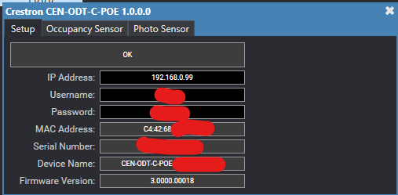
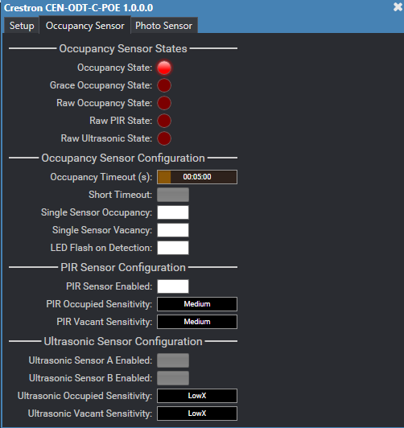
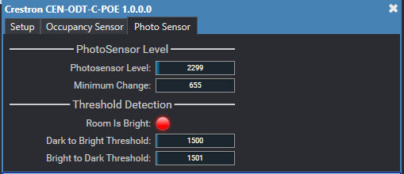

# Crestron CEN-ODT-C-POE Plugin

This is a control plugin for the Creston CEN-ODT-C-POE. It uses HTTPS for comminication and exposes most of the controls for Occupancy and the Photo Sensor, including some that are not accesable in the devices web ui.

[api reference](https://sdkcon78221.crestron.com/sdk/CEN-ODT-API/Content/Topics/Quick-Start-2.htm)

## Release Notes

- **v1.0.0.0**
  - Initial release

## Screenshots

